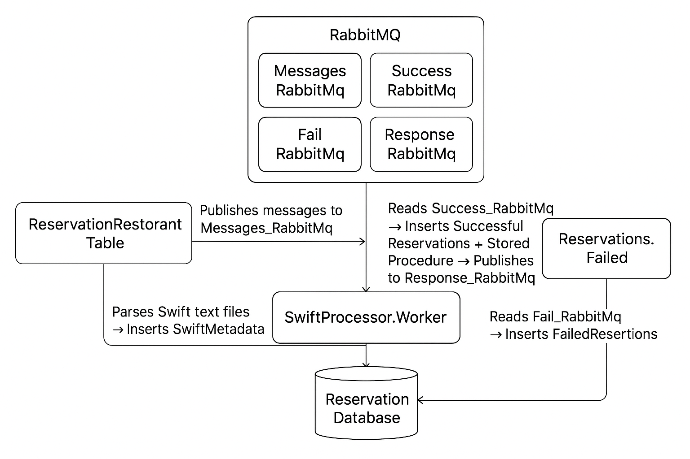

# Reservation System Solution

## Overview
This solution provides a modular reservation system built with **C# 13.0** and **.NET 9**.  
It includes components for managing reservations, handling successful reservation messages, database persistence, and application initialization.  
The architecture leverages **dependency injection**, **Entity Framework Core**, and robust **logging**.

---

## Projects

- **ReservationRestorantTable**  
  Main application entry point. Configures services, logging, and runs the host.

- **Reservation.Persistence**  
  Contains `ReservationDbContext` and data access logic. Handles database migrations and interactions.

- **Reservation.SuccessfulMessages**  
  Provides services for storing and logging successful reservation messages.

- **Reservation.Common**  
  Shared models and enums, such as `ResultMessage` and `ValidationResults`.

- **Reservation.Initializer**  
  Handles application and database initialization.

- **Reservation.Infrastructure**  
  Contains infrastructure services such as `IRabbitMqConsumerService` interface.  
  Provides the contract for consuming and publishing messages to RabbitMQ queues.

- **BackgroundWorkers**  
  Contains background workers that handle RabbitMQ message processing and file monitoring.

---

## Background Workers

### 1. `ProcessFailedMessages`
- **Purpose:**  
  Processes messages from the `FAILED` queue and stores them in persistent storage for later inspection or retry.

- **Workflow:**  
  1. Runs continuously as a background service.  
  2. Consumes messages from the `FAILED` queue using `IRabbitMqConsumerService`.  
  3. Saves each failed message via `IFailedMessagesService`.  
  4. Logs information about processed messages.

---

### 2. `ProcessSuccessfulMessages`
- **Purpose:**  
  Processes messages from the `SUCCESSED` queue, stores them, and optionally publishes a response message to the `RESPONSE` queue.

- **Workflow:**  
  1. Runs continuously as a background service.  
  2. Consumes messages from the `SUCCESSED` queue.  
  3. Saves each message via `ISuccessfulMessagesService`.  
  4. If a result object is returned, serializes it and publishes it to the `RESPONSE` queue.  
  5. Logs information about processed and published messages.

---

### 3. `FileMonitorWorker`
- **Purpose:**  
  Monitors a configured folder for new `.TXT` files, parses them as SWIFT messages, saves them to storage, and moves them to `successful` or `failed` subfolders.

- **Workflow:**  
  1. Runs as a background service and watches the specified folder.  
  2. Detects new `.TXT` files using `FileSystemWatcher`.  
  3. Waits until the file is fully written before processing.  
  4. Reads the file content and parses it as a SWIFT message.  
  5. Saves the parsed message using `ISwiftMessageService`.  
  6. Moves the file to `successful` or `failed` subfolder based on the result.  
  7. Logs all steps, including parsing success/failure and file moves. 

  ---

  ## Reservation System – Setup and Run Guide
  ### Start RabbitMQ in Docker 
	docker run -it --rm --name rabbitmq -p 5672:5672 -p 15672:15672 rabbitmq:4.0-management
  ### Run ReservationRestorantTable background worker
  Creates the database with the required tables.
  Initializes the necessary RabbitMQ queues.
  To also add the stored procedure, run the SQL script from: Reservation.SuccessfulMessages/sql scripts
  #### Settings (appsettings.json)
	"Logging": 
	{ 
		"LogFolder": "C:\\...\\ReservationRestorantTable\\Logs" // Folder where logs will be stored
	}, 
	"ConnectionStrings": 
	{ 
		"ReservationDbContext": "Username=;Password=;Host=localhost;Port=;Database=Reservation_db;" // Database connection string }, 
		"RabbitMq": { // RabbitMQ connection settings }
	}
 #### Example message published to Messages_RabbitMq queue
	"ClientName": "Tester Testerski", 
	"ClientTelephone": "0878878878", 
	"NumberOfReservedTable": 1, 
	"DateOfReservation": "2021-11-17 20:20:20" 
 - If valid ? message is published to Success_RabbitMq.
 - If invalid ? message is published to Fail_RabbitMq.

A background worker creates a new text file (named with today’s date) containing log entries.
### Run Reservation.SuccessfulMessages
 - Reads messages from Success_RabbitMq.
 - Inserts them into SuccessfulReservations using the stored procedure.
 - Publishes the message into Response_RabbitMq with ValidationResult = 9 (OK).

If the database or queues are not initialized, this worker creates them.

### Run Reservations.Failed
 - Reads messages from Fail_RabbitMq.
 - Inserts them into the FailedReservations table.

If the database or queues are not initialized, this worker creates them.

### Run ReservationRestorantTable
- Reads messages from Response_RabbitMq.
- Inserts a record into the Reservations table with the validation result.

### Database Description
- **Tables**
1. Reservations – all submitted reservations.
2. FailedReservations – reservations that failed validation.
3. SuccessfulReservations – reservations that passed validation.
4. SwiftMetadata – data parsed from text files by SwiftProcessor.Worker.

- The stored procedure must also be added using the script located in:
Reservation.SuccessfulMessages/sql scripts

### Run SwiftProcessor.Worker
Parses text files and initializes the database if not already created.
#### Configuration (appsettings.json)

		"MonitorSettings": 		
	    { 
	     "FolderPath": "C:\\..\\ReservationRestorantTable\\SwiftFiles" 
        }
#### Behavior
- Monitors the folder for new text files.
- Parses and inserts results into the SwiftMetadata table.
- Successfully parsed files ? moved to successful folder.
- Failed to parse files ? moved to failed folder.
- If a file with the same name exists, the worker appends the current date to avoid overwriting.

### Run with Docker
This project can be run entirely using Docker and Docker Compose. Follow the steps below:
	
	**Build and start all services**  
   From the root of the project, run:
       
	   docker compose up

This command will:

- Start RabbitMQ with management UI on ports 5672 (AMQP) and 15672 (web UI).

- Build and start all .NET services (reservation-restorant-table, reservation-successful-messages, reservations-failed, swift-processor-worker).

- Handle dependencies between services automatically (depends_on).
### System Architecture Diagram
